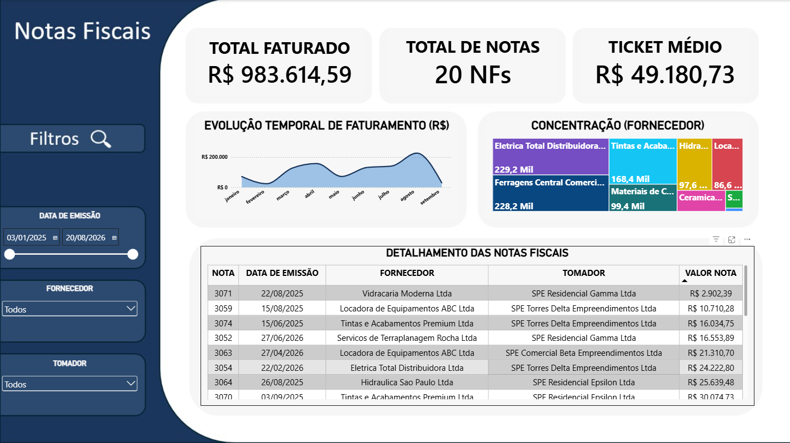

# Pipeline de Notas Fiscais → BI (Azure)

## Visão Geral

No meu estágio, trabalho com a manutanção e melhorias do sistema de notas fiscais da empresa, e senti falta de uma forma rápida de visualizar os dados assim que os pagamentos são concluídos. Sendo assim, esse projeto consiste em um pipeline serverless no Azure que recebe arquivos XML de NF-e, processa e estrutura os dados automaticamente, alimentando um dashboard com indicadores de gastos (por fornecedor, por período, por categoria, entre outros). Além disso, esse projeto é um exercício prático de alguns conceitos do Azure como armazenamento, computação serverless, identidade e governança (RBAC), e monitoramento + construção e apresentação de dashboards.

## Arquitetura

```
[XML NF-e] → [Storage Account: container "bruto"]
                     ↓ (Blob Trigger)
        [Azure Function - Python] (parse XML → extrai campos → JSON/CSV)
                     ↓
        [Storage Account: container "tratado"]
                     ↓
            [Azure SQL Database]
                     ↓
            [Power BI Desktop]
```

1. **Ingestão** — XMLs de NF-e são enviados a um container Blob (`bruto`)
2. **Processamento** — Azure Function é disparada (Blob Trigger), faz o parsing (análise) do XML e extrai os dados
3. **Armazenamento estruturado** — dados processados são armazenados em um container `tratado` e carregados no Azure SQL Database
4. **Visualização** — Power BI consome os dados estruturados e apresenta os indicadores

## Tecnologias

- **Azure Storage Account** (Blob Storage)
- **Azure Functions** (Python)
- **Azure SQL Database**
- **Azure Active Directory / RBAC** (controle de acesso)
- **Azure Monitor / Log Analytics** (monitoramento)
- **Power BI** (dashboard)

## Funcionalidades

- Ingestão automática de arquivos XML de NF-e
- Extração de campos: CNPJ do emitente, razão social do emitente, CNPJ do tomador, razão social do tomador, valor total, número da nota, data de emissão e chave de acesso
- Armazenamento estruturado e consultável via SQL
- Dashboard com indicadores

## Status Atual

- [x] Resource group, storage account e containers criados
- [x] SQL Server e SQL Database criados
- [x] Firewall e RBAC configurados
- [x] Conexão ao SQL Database
- [x] Criação da tabela de visualização
- [x] Criação e teste da Function localmente
- [x] Azure Function (parser de XML)
- [x] Dashboard Power BI

## Aprendizados

- Criação de storage account, conteineres, sql server, regras de firewall do sql server e atribuição de funções (RBAC) via Azure CLI.
- Provider `Microsoft.Sql` precisa estar registrado na subscription antes de criar recursos SQL (`az provider register`).
- `az sql db create` usa backup geo-redundante (`Geo`) por padrão — usar `--backup-storage-redundancy Local` pra manter tudo em LRS.
- Conexão ao database via VSCODE e criação da única tabela que alimentará o dashboard.
- Criação da Function, criação do código principal, requiremnts, .gitignore, entre outros.
- Teste da Function localmente com XML de teste gerado pela IA (bruto -> tratado + banco).
- Troubleshooting: falta de driver ODBC e timeout de TLS (local.settings.json).
- Publicação da function no Azure e testes.
- Criação de BI direcionado às notas fiscais.

## Dashboard



## Como rodar localmente

### Pré-requisitos

- Conta Azure (free tier)
- Azure CLI
- Azure Functions Core Tools
- Python
- ODBC Driver 18 for SQL Server
- Power BI ou Tableau

### Passos

1. Clone o repositório
```powershell
   git clone <https://github.com/BrunoKraker/pipeline-notas-fiscais>
   cd pipeline-notas-fiscais
```

2. Login no Azure
```powershell
   az login
```

3. Recrie o `local.settings.json` dentro de `function/nfs-function/`:
```json
   {
     "IsEncrypted": false,
     "Values": {
       "FUNCTIONS_WORKER_RUNTIME": "python",
       "AzureWebJobsStorage": "<connection-string-da-storage-account>",
       "SQL_CONNECTION_STRING": "Driver={ODBC Driver 18 for SQL Server};Server=tcp:<servidor>.database.windows.net,1433;Database=<banco>;Uid=<usuario>;Pwd=<senha>;Encrypt=yes;TrustServerCertificate=yes;"
     }
   }
```
   Pegue a connection string da storage account com:
```powershell
   az storage account show-connection-string --name <nome-da-storage-account> --resource-group <resource-group> -o tsv
```

4. Instale as dependências
```powershell
   cd function/nfs-function
   pip install -r requirements.txt
```

5. Libere seu IP atual no firewall do SQL Server
```powershell
   curl.exe -4 ifconfig.me
   az sql server firewall-rule create --resource-group <resource-group> --server <servidor> --name AllowMyIP --start-ip-address <seu-ip> --end-ip-address <seu-ip>
```

6. Rode a Function localmente
```powershell
   func start
```

7. Teste subindo um XML no container `bruto`
```powershell
   az storage blob upload --account-name <nome-da-storage> --container-name bruto --name teste.xml --file caminho\teste.xml --auth-mode login
```

## Data da Última Alteração

- 26/08/2026 00:23